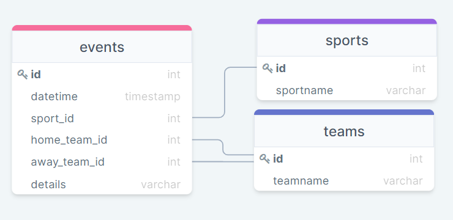
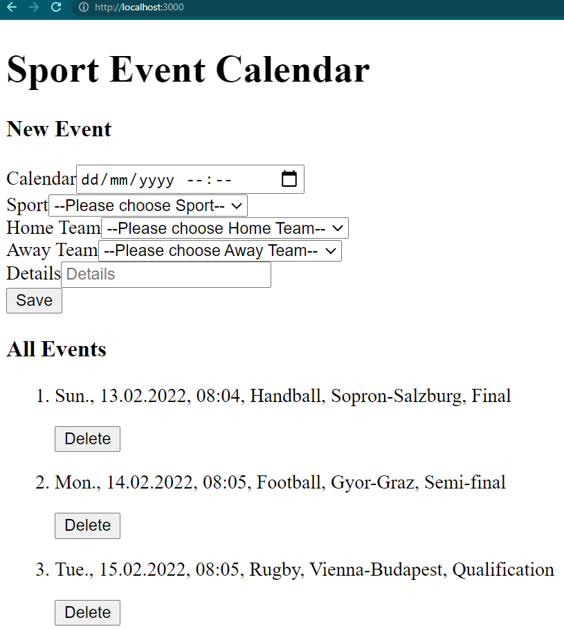

# Sport Event Calendar

This Next.js project was created for Sportradar as a coding academy exercise.

## List of features

- landing page with the list os sport events
- user can add new sport event
- user can delete existing sport event

## Database schema (ERD)

## Database set up

### Postgres

- download and install PostgreSQL
- start the database from the terminal:
  `$ postgres`
- open a new tab in the terminal and run the following command:
  `$ psql -U sportradar2022 sportradar;`
- Password for user sportradar2022: sportradar2022

### .env

- crate .env.example file in code editor's root containing:

PGHOST=xxxx
PGDATABASE=xxxx
PGUSERNAME=xxxx
PGPASSWORD=xxxx

- create .env file n code editor's root containing:

PGHOST=localhost
PGDATABASE=sportradar
PGUSERNAME=sportradar2022
PGPASSWORD=sportradar2022

### Migrations

- install:

  `$ yarn add ley`

- follow setup instructions

  https://github.com/lukeed/ley#cli

- invoke ley up to apply new migrations

  `$ yarn migrate up`

## HTML frontend

## Run the app

To run next.js app in the development mode use

> `yarn dev`

Open [http://localhost:3000](http://localhost:3000) to view it in the browser.
